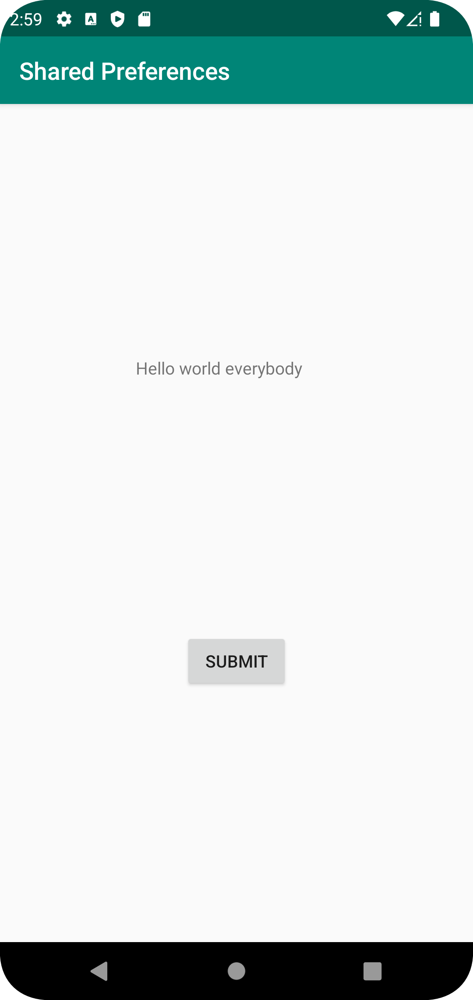
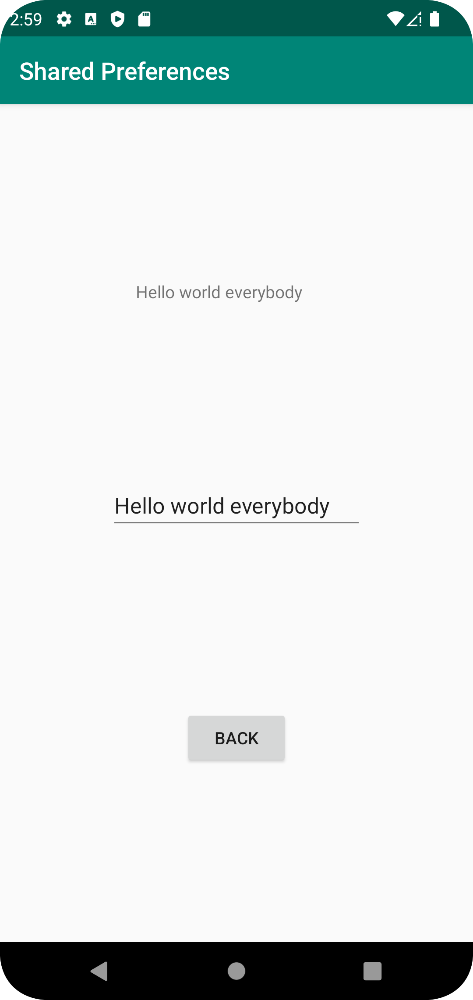

# Rapport

Började med att göra en layout för både main activity och för second activity. För main gjordes det 
en knapp som har texten "submit" som ska ta dig till second activity och en text view som då ska vara 
shared pref. 

```
<Button
    android:id="@+id/submitButton"
    android:layout_width="wrap_content"
    android:layout_height="wrap_content"
    android:text="Submit"
    app:layout_constraintBottom_toBottomOf="parent"
    app:layout_constraintEnd_toEndOf="parent"
    app:layout_constraintStart_toStartOf="parent"
    app:layout_constraintTop_toBottomOf="@+id/prefText" />

<TextView
    android:id="@+id/prefText"
    android:layout_width="wrap_content"
    android:layout_height="wrap_content"
    android:ems="10"
    android:inputType="textPersonName"
    android:text="shared pref here"
    app:layout_constraintBottom_toTopOf="@+id/submitButton"
    app:layout_constraintEnd_toEndOf="parent"
    app:layout_constraintStart_toStartOf="parent"
    app:layout_constraintTop_toBottomOf="@+id/appBarLayout" />
```


I second activity gjordes det en edit text som är då texten som man ska skriva för att få den texten man skrev på main activity
text view. Samt hade jag en button som har texten "back" som ska ta dig tillbaka till main activity och så gjorde
jag en textView som ska då vara som textview i main activity att den texten är shared pref.

```
<Button
    android:id="@+id/backButton"
    android:layout_width="wrap_content"
    android:layout_height="wrap_content"
    android:text="Back"
    app:layout_constraintBottom_toBottomOf="parent"
    app:layout_constraintEnd_toEndOf="parent"
    app:layout_constraintStart_toStartOf="parent"
    app:layout_constraintTop_toBottomOf="@id/editTextPref"
    />

<EditText
    android:id="@+id/editTextPref"
    android:layout_width="wrap_content"
    android:layout_height="wrap_content"
    android:ems="10"
    android:inputType="textPersonName"
    android:text="Name"
    app:layout_constraintBottom_toTopOf="@+id/backButton"
    app:layout_constraintEnd_toEndOf="parent"
    app:layout_constraintStart_toStartOf="parent"
    app:layout_constraintTop_toTopOf="parent" />
```

Därefter gjordes det så att man kunde klicka på knappen på main activity för att ta sig till second 
activity. 
```
submitButton.setOnClickListener(new View.OnClickListener(){
    @Override
    public void onClick(View view) {
        Intent intent = new Intent(MainActivity.this, SecondActivity.class);
        startActivity(intent);
    }
});
```

Därefter gjordes det två variabler som har datatypen "SharedPreferences", dessa två variabler
användes för att spara de data som skrev på edittext på second activity. 
Därefter gjordes det en onResume funktion som hämtar id för text view och gör så att den får texten
som skrevs in på second activity.

```
@Override
protected void onResume(){
    super.onResume();
    TextView prefTextData = findViewById(R.id.prefText);
    prefTextData.setText(myPreferenceRef.getString("key", "Name"));
}
```

I second activity börjades med att göra så att knappen fungerade så att man kan ta sig till main
activity. Därefter gjordes det på samma sätt som i main activity att göra dessa SharedPreferences 
variabler och sätta detta i editText. Jag ladde ju till en extra text view i second activity så att
man kan se de sparade datan. Denna view gör inget extra än att göra samma sak som i main activity. 
```
EditText editTextPref = findViewById(R.id.editTextPref);
editTextPref.setText(myPreferenceRef.getString("key", "No preference found."));

TextView textView = findViewById(R.id.textView);
textView.setText(myPreferenceRef.getString("key", "No preference found."));
```

Som sist gjordes den en funktion som heter StoreData och sätter in datan när man har skrivit något
edittext och detta görs när man klickar på knappen för när man tar sig till main activity. Så man
kallar på funktionen i "onClick" funktionen när man klickar.

```
 void StoreData(){
    EditText editText = findViewById(R.id.editTextPref);
    myPreferenceEditor.putString("key", editText.getText().toString());
    myPreferenceEditor.apply();

}
```




